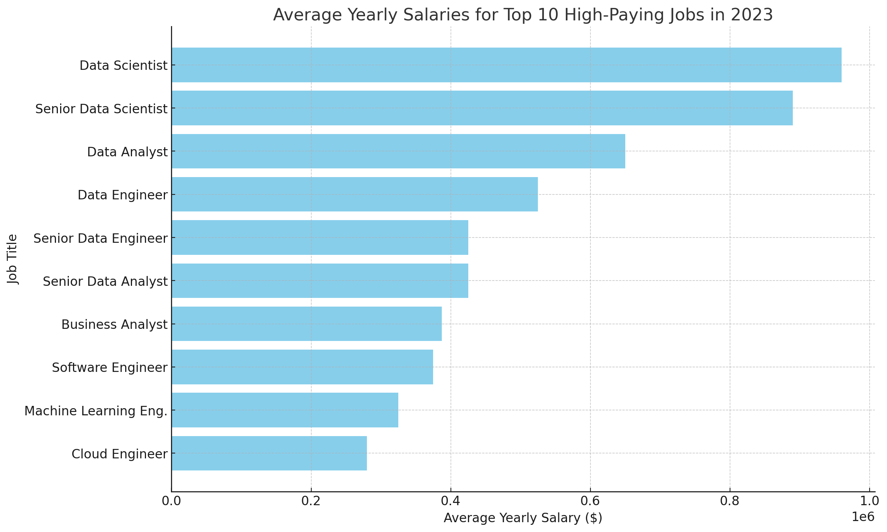
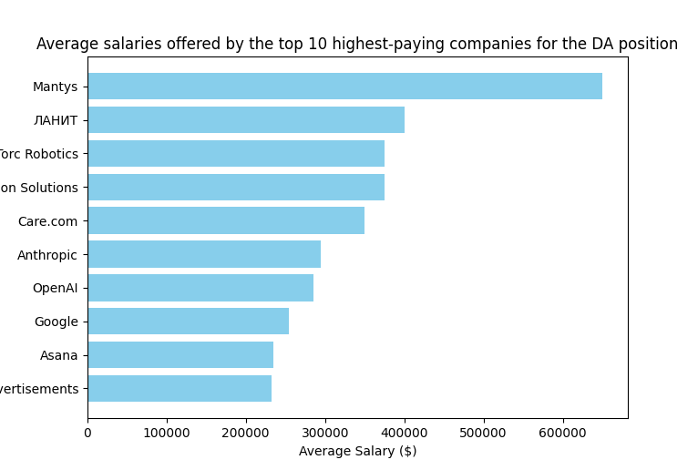

# Introduction 
Welcome to the Job Market Analysis Project! In today's rapidly evolving job market, understanding the dynamics that drive employment opportunities, compensation, and employer benefits is crucial for job seekers and human resources professionals alike. This project aims to delve deep into these aspects, providing insights into in-demand skills, top-paying job titles, and the competitive offers provided by various companies.

# Background
### This project is built to answer the following questions:

1. What are the top 10 high-paying jobs in 2023?

2. What are the top 5 skills required for data scientist?

3. What are the top 10 companies offered jobs without a degree?

4. What are the top 10 companies offered work from home jobs?

5. What are the average salaries offered by the top 10 highest-paying companies for the 'Data Analyst' position?

# Data and Tools Used
## Data
This project leverages data curated by Luke Barousse, which encompasses a broad spectrum of job market dynamics.

## Tools Used
* SQL 
* PostgreSQL 
* Visual Studio Code 
* Git and GitHub

# The Analysis 
## 1. Top 10 high-paying jobs in 2023
This SQL script fetches the highest-paying job for each title from the 2023 job postings, focusing on those with non-null salaries. It ranks these jobs within their respective titles by salary in descending order and selects the top one from each group. Finally, it lists the top 10 highest salaries, showing only the best-paid position for each unique job title.

```
SELECT 
    job_title_short,
    job_posted_date,
    salary_year_avg
FROM ( -- Logic: salary_year_avg sorted in desc order -> rank 1st of ea. job title to represent
    SELECT 
        job_title_short,
        job_posted_date,
        salary_year_avg,
        ROW_NUMBER() OVER (
            PARTITION BY job_title_short 
            ORDER BY salary_year_avg DESC
            ) AS rn
    FROM 
        job_postings_fact
    WHERE
        EXTRACT(YEAR FROM job_posted_date) = 2023
        AND salary_year_avg IS NOT NULL
) AS a
WHERE rn = 1
ORDER BY salary_year_avg DESC
LIMIT 10;
```

_Bar graph visualizing the salary for the top 10 salaries; ChatGPT generated this graph from the SQL queries results._

As shown, the graph provides a clear comparison of the salaries across various job roles, with "Data Scientist" being the highest paid and "Cloud Engineer" at the lower end of the top 10 scale for this dataset. The salary range is varied from $280,000 to $960,000. 

## 2. Top 5 skills required for data scientist
Counting the occurrences of each skill associated with 'Data Scientist' job postings and grouping the results by skill and ordering them in descending order based on frequency. The query limits the output to the top 5 most frequently mentioned skills, providing insights into the most in-demand competencies for data scientists.
```
SELECT
    skills_dim.skills,
    COUNT(*) AS frq
FROM 
    job_postings_fact
JOIN 
    skills_job_dim ON skills_job_dim.job_id=job_postings_fact.job_id
-- Now skills_job_dim have both job_title and job id -> join for skills 
JOIN 
    skills_dim ON skills_dim.skill_id=skills_job_dim.skill_id
WHERE -- 2nd in execution order
    job_postings_fact.job_title_short = 'Data Scientist'
    -- or ILIKE '%Data Scientist%' for case sensitive
GROUP BY
    skills_dim.skills
ORDER BY    
    frq DESC
LIMIT 5; 
```
**Python**, the most demanded skill, is essential for its versatility in analysis, machine learning, and data manipulation. **SQL** is crucial for database management and data retrieval, while **R** is preferred for statistical analysis, particularly in academia. 
**SAS** is valued in finance and healthcare for its robust analytics capabilities, and **Tableau** is essential for creating effective data visualizations to communicate insights.
This summary provides a comprehensive overview of the most in-demand skills in data science, illustrating their applications and importance across various domains.

| Skills  | Frequency |
|---------|-----------|
| Python  | 114,016   |
| SQL     | 79,174    |
| R       | 59,754    |
| SAS     | 29,642    |
| Tableau | 29,513    |
_Table of the demand for top 5 skills in data scientist job postings_ 

## 3. Top 10 companies offered jobs without a degree
The objective is to identify the top 10 companies offering the most jobs without requiring a degree, by counting job postings where a degree isn't specified. The results are grouped by company name and sorted to highlight those with the highest count of such job opportunities. This information helps identify employers who prioritize skills and experience over formal education.
```
-- 3. What are the top 10 companies offered jobs without a degree?
SELECT 
    company_dim.name,
    COUNT(job_postings_fact.job_id) AS job_count
FROM 
    company_dim
JOIN 
    job_postings_fact ON company_dim.company_id = job_postings_fact.company_id
WHERE 
    job_postings_fact.job_no_degree_mention = 'Yes'  
GROUP BY 
    company_dim.name
ORDER BY 
    job_count DESC
LIMIT 10;
```

| Name            | Job Count |
|-----------------|-----------|
| Emprego         | 3,048     |
| Robert Half     | 970       |
| Listopro        | 868       |
| Dice            | 867       |
| Insight Global  | 842       |
| Accenture       | 800       |
| Michael Page    | 694       |
| Harnham         | 680       |
| Hays            | 603       |
| Confidenziale   | 594       |
_Table of the top 10 companies that do not require formal degrees_ 

## Top 10 companies offered work from home jobs
This analysis will highlight the top 10 companies that are leading the way in offering remote work opportunities. It showcases employers who provide the most jobs with the flexibility of working from home. The SQL query counts the number of such jobs for each company by checking job postings that specifically list work-from-home options. The results are grouped by company and then ordered to show which companies have the highest number of remote job opportunities, highlighting the top ten for job seekers interested in finding positions that allow them to work remotely.
```
SELECT 
    company_dim.name,
    COUNT(job_postings_fact.job_id) AS job_count
FROM 
    company_dim
JOIN 
    job_postings_fact ON company_dim.company_id = job_postings_fact.company_id
WHERE 
    job_postings_fact.job_work_from_home = 'True'
GROUP BY 
    company_dim.name
ORDER BY 
    job_count DESC
LIMIT 10;
```
| Company Name                          | Job Count |
|---------------------------------------|-----------|
| Listopro                              | 1,560     |
| Dice                                  | 1,427     |
| Upwork                                | 1,376     |
| Get It Recruit - Information Technology | 889       |
| EPAM Systems                          | 428       |
| Harnham                               | 401       |
| Insight Global                        | 338       |
| EPAM Anywhere                         | 308       |
| Crossover                             | 278       |
| TELUS International AI Data Solutions | 276       |
_Table of the top 10 companies that offer work from home benefits_ 

## What are the average salaries offered by the top 10 highest-paying companies for the 'Data Analyst' position?
This query retrieves the average salaries for the 'Data Analyst' position offered by the top 10 highest-paying companies. It calculates the average annual salary based on existing data and ranks the companies in descending order based on these averages. The analysis includes only those records where the salary data is available, ensuring that the results reflect actual reported salaries.

_Bar graph visualizing the average salary for the top 10 highest-paying companies for the 'Data Analyst' position._